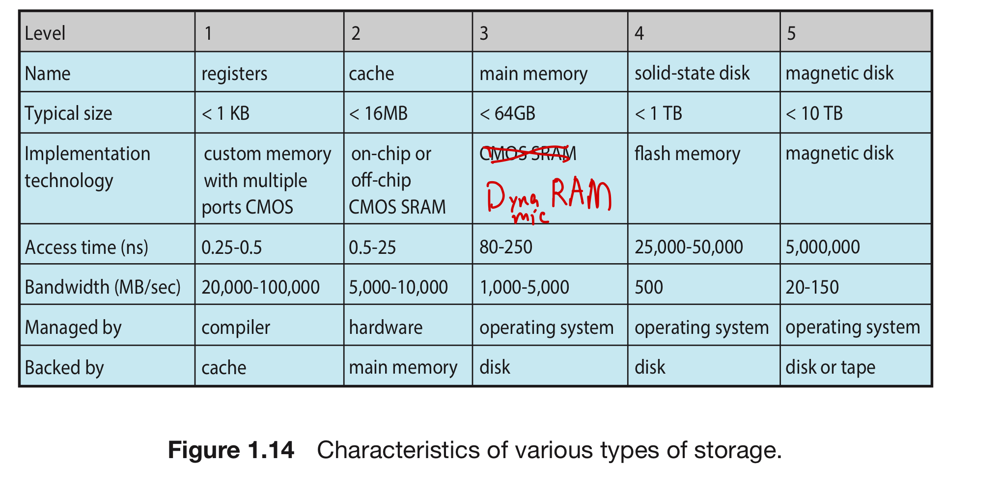

READINGS: SECTION 1.5 - 1.6, 1.10 - 1.11

### 1. System Components (1.5 Resource Management)
#### 1.1 Process Management (1.5.1 & Chapter 3 - 7 )
A process is `a program in execution`. It is a unit of work whin the system.  
- A program is `passive entity`, a process is an `active entity`  
  - A program can do nothing unless its instructions are executed by a CPU

A process needs resources to accomplish its task
- E.g. CPU. memory, I/O devices, files

Process `Termination` will let OS reclaim any `reusable resources`

A single-threaded process has one `program counter` specifying `location` of next instruction to execute
- Processes execute instructions generally `sequentially` until completion

A multi-threaded process has one program counter per thread

Typically a system has many processes(user/operating system) running concurrently on single CPU core by multiplexing or more CPUs cores in parallel

---

The OS is responsible for the following activities in connection with process management
- Process Creation and Deletion
- Process Suspension and Resumption
- Provision of Mechanisms for:
  - Process Synchronization
  - Process Communication
  - Deadlock Handling
---

#### 1.2 Memory Management (1.5.2)
Memory is a large array of words or bytes, each with its own address
- The CPU reads instructions from Main Memory during the `instruction-fetch cycle` and both reads and writes data from main memory during the `data-fetch cycle` 【on a von Neumann Architecture】

Main Memory is a `volatile` storage device
- volatile: everything disappears when power off

The OS is responsible for the following activities in connection with memory management:
- Keep track of which parts of memory are currently being used and by whom and which parts are free
- Decide which processes to load when memory space becomes available
- Allocate and deallocate memory space as neededd

#### 1.3 File-System Management (1.5.3)
The OS `abstracts` from the physical properties of its storage devices to define a logical storage unit, the `file`
  - The OS maps files onto physical media and accesses these file via the storage devices
  - A file is a collection of related information defined by its creator
  - Files represent programs (both source and object forms) and data
The OS is responsible for the following activities in connection with file management
- File/Directory creation and deletion
- Support of `primitives` for manipulating files and directories
- Access control available on most systems
- Map files onto secondary storage 
- File backup on stable(nonvolatile) storage media
#### 1.4 Secondary (Mass) Storage Management (1.5.4)
Since main memory (primary storage) is volatile and too small to accommodate all data and programs permanently, the computer system must provide `secondary storage` to back up main memory
- Most modern computer systems use disks as the principle storage medium, for both programs and data.

The OS is responsible for the following activities in connection with disk management
- Free Space Management
- Storage Allocation
- Disk Scheduling (only for a hard disk drive【**HDD**】, not solid-state drive【**SSD**】) = **【QUIZ 2!!!!】**
  - Difference: SSDs have no moving parts (physical reason), disk-scheduling algorithms can improve the effective bandwidth of HDDs, average response time, and the variance in response time. In contrast, performance varies little among scheduling algorithms for SSDs.
- Movement between levels of storage hierarchy can be explicit oer implicit

#### 1.5 Cache Management
Information is normally kept in some storage system (such as main memory)

Multitasking Environ
Magnetic Disk ==> Main Memory ==> Cache ==> Hardware
#### 1.6 I/O System Management
One purpose of OS is to hide peculiarities of hardware devices from the User  
The I/O system consists of:
- A buffer-caching system
- A general device-driver interface
  - device driver set of interrupt handlers
- Drivers for specific hardware devices

### 2. Protection and Security

