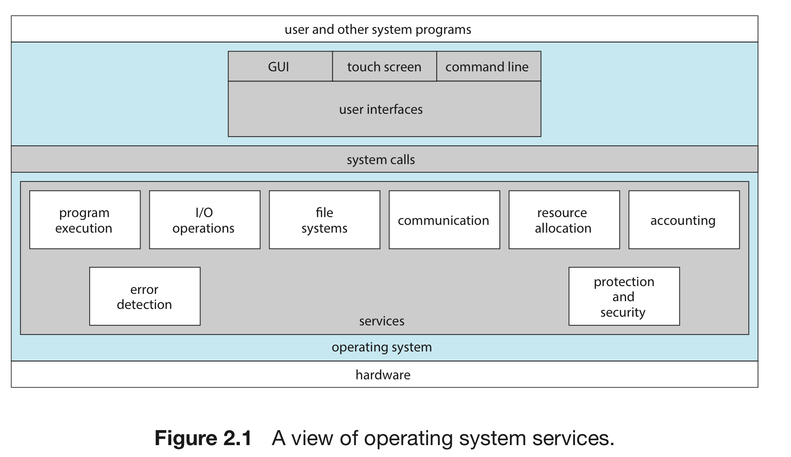

## Reading Chapter 2.1 - 2.8, 2.10

### 1. OS Services (Section 2.1)

- These OS services make the programming task easier for the programmer

User Interface (UI)

### 2. User and OS Interface (2.2)

### 3.
