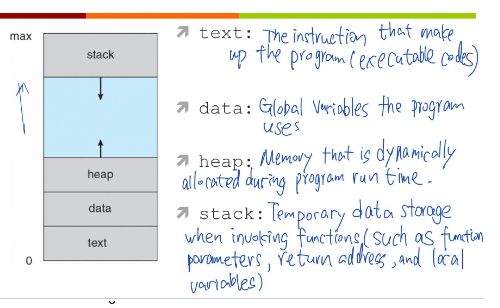

### May 26, Tues 13:30 - 14:30 (10 pages)
#### Readings: Chapter3: Proecesses - Section 3.1
---
### 1. What is a Process? 
**Fundamental building block** of modern operating systems is the notion of **process**
> A process is a program in execution, this includes:
- All programs running on behalf of users (application programs)
- Some OS functions are also implemented using processes
- A single thread of execution under control of the OS
#### 1.1 Process Details
- Much of the functionality of a modern OS is the work required to manage processes
- OS may have hundreds of processes active at the same time
  - Although only a small # are executing in a multi-core system
- Processes are not found inside the OS kernel
  - Kernel manages all processes
#### 1.2 What is not a Process
- A program by itself is not a process
- No 1-1 corrrespondence between programs and processes
  - there may be 10 people using emacs at the same time
    - i.e.10 **processes** running emacs, but only one copy of the emacs **program** on disk
  - there may be many programs on disk that are not executing at the present time
    - ==> these are NOT processes
  - Programs are passive entities, processes are active entities
 #### 1.3 Layout of A process in Memory (P5)

### 2. Process States (3.1.2 P6)
Modern OSes allow
- dang
-
-
### Process State Diagram

### Process Control Block
