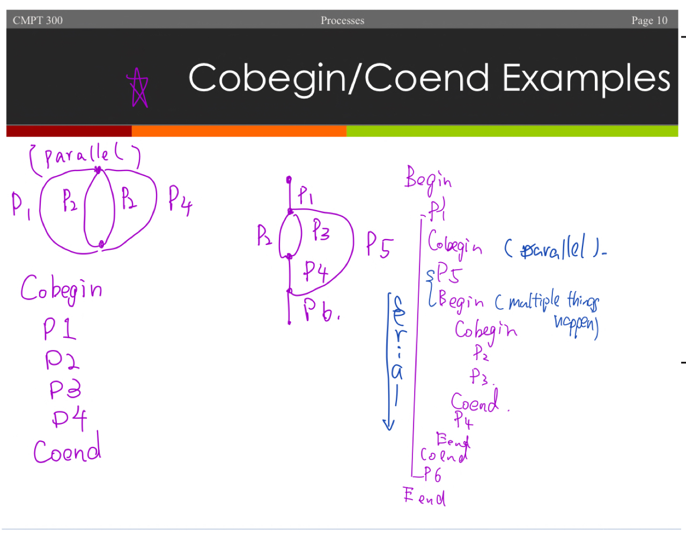

## lecuture 5 | 21 pages 
#### Process Concurrency | Race Conditions | Process Creation | The Critical Section Problem
#### Readings: Chapter 3: Processes - sections 3.2 to 3.5 
#### Chapter 6: Synchronization Tools - sections 6.1 to 6.3

### 1. Precedence & Concurrency (优先级和并发 P2 | Section 6.1）
`Logical Concurrency` is achieved on a uni-processor system by quickly switching the CPU from one process to the next
- Two processes which share data, P1 must precede P2
```
P1: A = B + X
P2: D = A * 2
```
- In general, the issues of precedence and concurrency are the same for `logical or physical concurrency`
- When it is Okay for two or more processes to execute concurrently so that we always get consistent results?
  - Depends on what resources are shared between the processes
  
### 2. Race Condition
- Race Condition: When there is a denpendency on the `exact execution order` of statements between two or more processes (different order may lead to different results)
#### 2.1 Read & Write Sets
- A process' read set is the set of `all data in RAM, secondary storage, or other existent data` that a process reads (uses during execution)
  - denoted R(P) for process P
- A process' write set is the set of all data that a process writes (`changes` during execution)
  - dennoted W(P) for process P
#### 2.2 Bernstein's Concurrency Conditions
Used to dictate when two processes are able to execute concurrently, and always produce consistent results
- BCC are as follows: in order for two independent processes P1 and P2 to run concurrently, the folowing 3 conditions must hold:
  - R(P1) cannot intersect W(P2)
  - W(P1) cannot intersect R(P2)
  - W(P1) cannot intersect W(P2)
- If two processe4s does not satisfy BCC, then they are said to have
  - ==> `Critical Section Problem`
  - Critical Sections are the sections of code that `cause violation of BCC`
#### Process Flow Graphs
PFG is a simple directed graph that depicts precedence and concurrency relationships among a group of processes
- The graph is said to be `properly nested` if:
  - it can be described by a simple composition of the process function P and S:
     - P(P1,P2) denotes: a parallel execution of two processes, beginning and ending at the same point in the graph
     - S(P1,P2) denotes: a serial execution of P1 followed by P2
  - Both P & S have only 2 arguments!

- S & P compositions are difficult to read and write, and are unable to describe non-properly nested situations

#### 2.3 Cobegins & Coends Consturct
This is just another way of writing S() and P() functions
- Only works with properly nested graphs
Statement Written between a:
- `cobegin/coend pair` are executed in parallel
- `begin/end pair` are executed in serial, in the order they appear


### 3. Process Creation Constructs (P11 | Section 4.5.2)
- One mechanism for creating processes is called **fork and join**  
- Fork(label L) produces 2 concurrent processes, **one starts immediately after the fork statement, and one starts at `label L (an address)` [example]**
  - Splits a single process into two concurrent processes
- Join(int x) recombines x processes into 1, effectively throwing away the first x-1 processes that reach it, and continuing execution after the `Join statement`, **when the xth process reaches it** 
![fork join examples)[imgs/fork_join_examples.jpeg]

### 4. The Critical Section Problem (P13 | Section 6.2)
 
