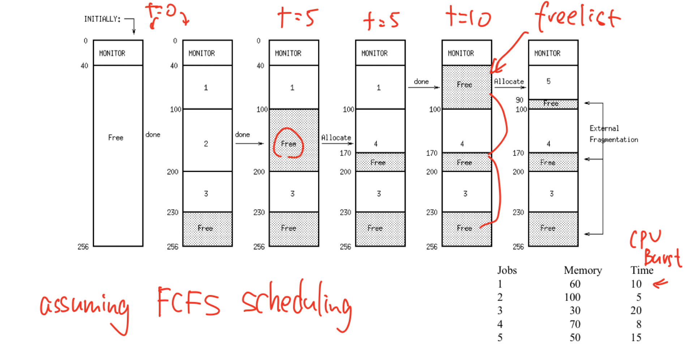
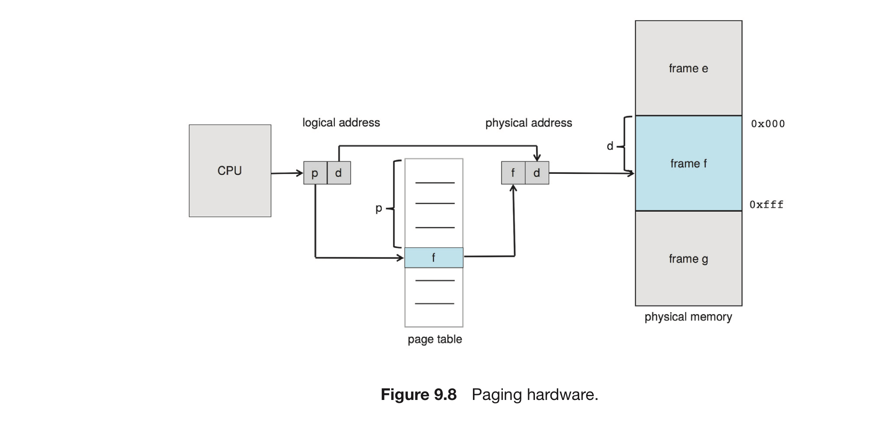

## July 9 Lecture 16 Thursday | 31 Pages
- Section 9.2 - Contiguous Memory Allocation
- Section 9.3 - Paging (page 23 - page 31)
- Section 9.5 - Swapping Page 2 - 8

### 1. Swapping （Page 2 | Section 9.5)
Process instructions and the data they operate on must 【be in memory】 to be execute 
- However, a process (or a portion of a process) can be `swapped` temporarily 【out of memory】 to a `backing store`(e.g. Disk) and then brought 【back into memory】for continued execution
  - Current memory contents written to a **backing store** (disk)
  - **Memory Image** for the next user process read in
  - Ready Queue contains processes whose memory images are on disk (and ready to run)

The Backing Store Candidates:
- fast secondary storage (i.e. disk)
- large enough to accommodate whatever parts of processes need to be stored and retrieved
- provide direct access to these **memory images**

The Swapping Candidates:
- Idle or mostly idle processes
- Inactive

Context Switch (Section 3.2.3 | Page 3-4)
- Def: Switching the CPU core to another process requires performing a state save of the current process and a state restore of a different process.
- This Task is time-consuming
  - Dependent Upon the device performance
  - If we used a scheduling scheme like Round Robin, we would want a VERY large **time quantum**
  
We need to set up two `buffers`: "incoming" and "outgoing"
- At context Switch time we do two memory-to-memory copies
- During Application Execution, we do two disk-to-memory copies to update the buffers 
  - requires a DMA device
#### Advantage of swapping
Swapping makes it possible for the **total physical address space** of all processes to exceed the **real physical memory** of the system (oversubscribed)
- ==> increasing the degree of multiprogramming in a system

#### Swapping with Partitions (Page 5 - 8)
Swapping with multiple programs(buffers)
- A fence is inadequate

Because the amount of time required to move entire processes between memory and the backing store is prohibitive (望而却步)
- Do some copying at context switch time (just more overhead)
  - overhead: the processing time required by a device prior to the execution of a command
- Need to `protect access` both before and beyond the User Program（Lec15）
  - Upper/Lower Bound
  - Base/Limit Registers
    - The relocation register contains the value of the smallest physical address
    - The limit Register contains the range of logical addresses
    - Each logical address must fall within the range specified by the limit register
    - The MMU maps the logical address `dynamically` by adding the value in the base register
      - This mapped address is sent to memory

Part of the context switching is the reloading of these registers with the correct values by the dispatcher(Sec 9.2.1)
- when CPU scheduler selects a process for execution
- Now, swapping can be done outside of the user space, W/O copying

**Most Significant**: Swapping can be **eliminated** in some cases:
- Processes can stay in memory between CPU Bursts

### 2. Contiguous Memory Allocation ( Page 9 - 16 | Section 9.2)
The memory is usually divided into a set of fixed partitions:
- one for the OS
- the rest for the various user processes 

Each Partition can be scheduled separately
- Possibly a separate ready queue for each memory partition

**Bounds are set** just before and after the partition for the running job
- A Process cannot span partition boundaries
- A partition cannot be shared
  - when a process is done, another approprivately sized job will take its place

#### 2.1 Memory Allocation (Sec 9.2.2 | Page 10)
The simplest method is to assign processes to variably sized partitions in memory, 
- where each partition may contain exactly one process.

The OS keeps track of (a table to indicate) which memory is in use and which are available 
- Initially, all memory is available for user processes and is considered one **large block** of available memory, `a hole`
- Eventially, memory contains **a set of holes** of various sizes （大大小小的空余空间）
- We could add swapping done separately for each partition 
  - e.g. When 6k job begins an I/O burst, we could swap it and put another job in.

(Fixed Number of Tasks)What if a 1.5K process in the 2K spot asks for another 1K of memory?
- 1. abort the process
- 2. deny the request
- 3. swap it out and put it on the queue for the 6K partition
  
Region size selection is difficult (**For a Fixed Number of Tasks**)

#### 2.2 Dynamic Storage Allocation Procedure (Page 13 - 19)
For a variable number of Tasks
- MVT - "Multiple, contiguous variable partition allocation"

When a process arrives and needs memory,
- the system searches the set for a **hole** that is large enough for this process
- If the hole is too big, it is split into two parts
  - one part is allocated to the arriving process
  - the other is returned to the set of holes.

When a process terminates,
- it releases its block of memory, which is then placed back in **the set of holes** 
- If the new hole is adjacent to other holes, they are merged to form one larger contiguous block.

`Dynamic Storage allocation Problem`: how to satisfy a request of `size n` from a list of free holes?
- with efficiency of allocation and freeing
- and minimization of fragmentation

#### 3 Solutions (Page 18 - 19)
First Fit: Allocate the first hole that is **big enough** to satisfy the request
- faster

Best Fit: Allocate the smallest hole that is big enough
- must search the entire list unless the list is ordered by size
- produce the smallest leftover hole to minimize fragmentation

Worst Fit: Allocate the largest hole
- produce the largest leftover hole, which may be more **useful** than the smaller leftover hole from a best-fit  approach
- also reduce fragmentation

Example: what if a request is made for `19995 blocks` of storage, and there is a `20000 block` space free?
- The overhead to keep track of the wasted five bytes **is more than** the hole itself.
- Break the physical memory into fixed-sized blocks and allocate memory in units based on block size
  - **allocate all 20000** blocks in this case
  - the memory allocated to this process may be **slightly larger** than the requested memory ==> the difference is internal fragmentation

Conclusion: There are many algorithms for the general storage allocation problem
- Many **trade-off** between one of allocation/freeing time and fragmentation for the other
- Some are close to O(1) both allocation and freeing（at the expence of fragmentation 以碎片为代价）

#### 2.2 Fragmentation (Section 9.2.3 | Page 11 - 12)
Internal Fragmentation: unused memory internal to a partition that is wasted because of the way we set up the partitions
- E.g. An Xk process running in a Yk partition 
  - (Y-X)k is wasted space
  
External Fragmentation: enough total memory space to satisfy a request but the available spaces are not contiguous =>
- storage is fragmented into a large number of small holes 

#### Compaction (Page 20 - 22, Sec 9.2.3)
External fragmentation problem can be severe, in the worst case:
- A block of free (or wasted) memory between every two processes
- Goal: Shuffle the memory contents so as to place all free memory together in one **large block** ==> Compaction
- big enough to run a program while each of the smaller blocks were not

Compaction is not always possible.
- NOT be done if relocation is **static** and is done at assembly or load time
- only if relocation is **dynamic** and is done at **execution time**.
  - if addresses are relocated dynamically, relocation requires ONLY moving the program and data and then changing the **base register** to reflect the new base address

Swapping / Compaction can be used together
- when the jobs are swapped back in, they can be placed together to leave the largest hole

Cost Expensive:
- Move all processes toward one end of memory, all holes move in the over direction
- The memory occupied by a process must be contiguous
  - greatly reduce the cost of dealing with fragmentation 【if the memory didn't need to be contiguous】 ==> Paging!
  
### 3. Paging (Page 23 - Page 31 | Section 9.3)
Definition: the most common memory-management technique to avoid external fragmentation and associated need for compaction (two problems that plague contiguous memory allocation) 
- Goal: to permit the **logical address space** of processes to be `noncontiguous`, thus allowing a process to be allocated **physical memory** wherever such memory is available.
  - any available chunk of memory is usable even if it isn't large enough to hold the entire object 
#### 3.1 Basic Method (Page 24)
Paging is implemented through cooperation between the OS and the computer hardware support

The basic method for implementing paging involves 
- **Breaking** physical (main) memory into **fixed-sized blocks** called `frames` (现实）
- **Breaking** logical memory into **blocks of the same size** called `pages`（理想）
  - size determined by hardware
  - all pages but the last pages are the same sizes
    - e.g. A 15K program will be broken into three 4k pages and one 3k page
  - frame size = page size
  - one page fits into one frame exactly
  - last page for each object may be smaller, therefore occupies only part of one frame (remainder is wasted ==> internal fragmentation)

When a process is to be executed, its **pages** are loaded into any available **frames** from their source (a file system or the backing store)
- The backing store is divided into fixed-sized blocks that are the same size as the memory frames
- Wide Ramifications: the logical address space is totally separate from the physical address space, so a process can have a logical 64-bit address space even though the system has **less than** 264 bytes of physical memory

| page number|page offset(displacement)|  
|:----------:|:-------------:|
|p|d|
|m-n|n|

Every (logical)address generated by the CPU is divided into two parts
- a page number (p): (offset from top of module) / (page size)
  - used as an index into a per-process `page table` ( = data structure for each process)
    - the page table contains the **base address** of each frame in physical memory
    - map showing where each part of the process is loaded in memory
- a page offset (d): (offset from top of module) % (page size)
  - the location in the frame being referenced in physical memory
  - the base address of the frame + the page offset ==> define the physical memory address

 

The Steps taken by the MMU to translate a logical address generated by the CPU to a physical address: 
- 1. Extract the **page# p** and use it as an index into the page table
- 2. Extract the corresponding **frame# f**(base address) from the page table
- 3. Replace the **page# p** in the logical address with the **frame# f**
- As the **offset d** does not change, it is not replaced, and the frame# + offset now **comprise the physical address**

The size of a page (and frame) is a power of 2, typically varying between 4KB and 1GB per page, depending on computer architecture (hardware). (Page 26)
- If the size of the logical address space is 2m, a page size is 2n bytes, 
  - the **high-order** `m-n bits` of a logical address designate the `page number`
  - the `n` **lower-order** bits designate the page offset

#### Paging Example:
Consider main memory with 32 bytes memory locations (words)
- Page size of 4 words (bytes) ==> 8 Pages(number)
- Physical memory address size? - 5 Bits (32 = 25)
- Bits for the page number - 3 Bits ( 8 = 23)
- Bits for the page offset - 2 Bits ( 4 = 22)
  - Logical Address 0 = page 0, offset 0 ==> frame 5
    - maps to physical address 20 [=(5x4)+0]
  - Logical Address 13 = page 3(=13/4), offset 1(=13%3) ==> frame 2
    - maps to physical address 9 [=(2x4)+1]
  

#### Fragmentation (Page 29)
No External Fragmentation:
Some Internal Fragmentation
TOGO: page 30 and 31 (page implementation) will be in lecture 17 (Section 9.3.2)
