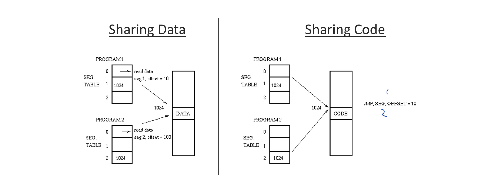
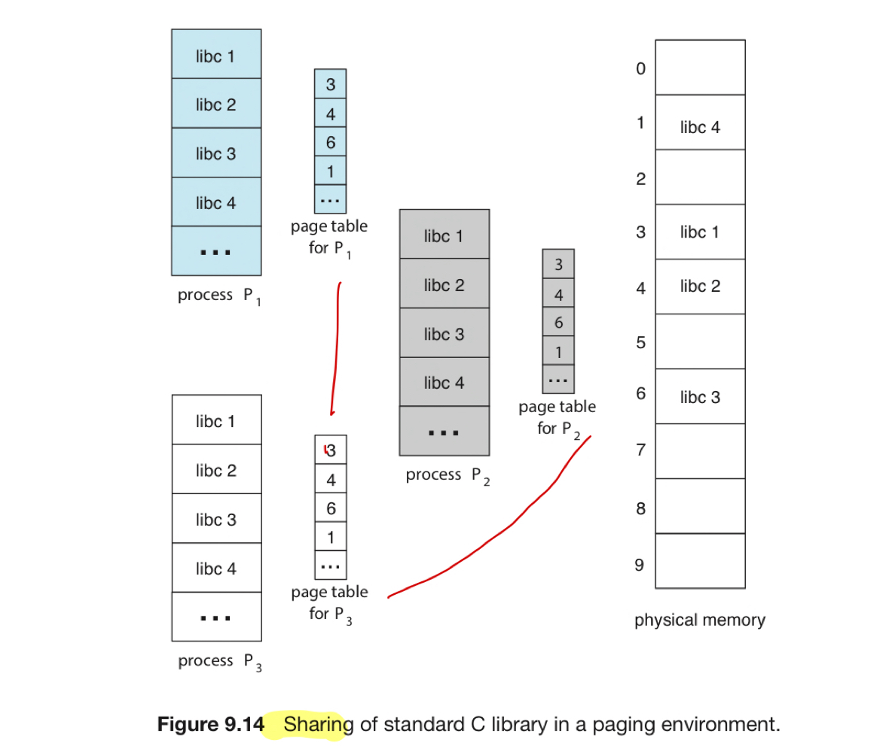

## July 14 | Lecture 17 | 10 pages
- 9.3.2: Hardware Support
- 9.3.3: Protect
- 9.3.4: Shared Page
- Modern Operating Systems Section 3.7: Segmentation

### 1. Page Table Implementation (Lec16_Page 29 - 31 | Section 9.3.2: Hardware Support)
The page table for each process is kept in its PCB (Process Control Block: to represent each process in the OS | Section3.1.3 )
- There is also a hardware register that has a pointer(like the instruction pointer) to the page table for the currently executing process
- When CPU scheduler selects a process for execution,
  - it must reload the user registers
  - and the appropriate hardware page-table values from the **stored user page table**

Where do we store the page table? 
- if the page table is reasonably small (256 entries):
  - the page table is implemented as a set of dedicated high-speed **hardware registers**
    - makes the page-address translation efficient!
    - but increases context-switch time, during which each one of these registers must be exchanged
  
- Larger page tables (220 entries)
  - the page table is kept in main memory
  - a **page-table base register**(PTBR) points to the page table
  - Changing page tables requires changing only this one register, substantially **reducing** context-switch time (faster!)
    - also results in **slower** memory access times

#### 1.1 Translation Look-Aside Buffer (TLB)
Storing the page table in main memory requires two memory accesses to access data:
- one for the page-table entry 
- one for the actual data

Memory access is slowed by a factor of 2, a delay is considered intolerable under most circumstances
- solution: TLB - special, small, fast-lookup hardware cache

TLB is associative, high-speed memory, each entry in the TLB consists of two parts:
- a key (or tag)
- a value

The TLB is used with page tables in the following way:
- The TLB contains only **a few of** the page-table entries
- when a logical address is generated by the CPU
- the MMU first checks if its page number is present in the TLB
  - if the page number is found, its frame number is immediately available and is used to access memory
  - if the page number is not in the TLB (TLB miss), address translation proceeds(where a memory reference to the page table must be made), when the frame number is obtained, we can use it to access memory
    - add the page number and frame number to the TLB,
    - so that they will be found **quickly** on the next reference
    

These steps are executed as part of the **instruction pipeline** within the CPU, adding no performance penalty compared with a system that does not implement paging.
#### 1.2 Average Memory Access Time 
Hit Ratio: the percentage of times that the page number is found in the TLB
- An 80% hit ratio means that we find the desired page number in the TLB 80% of the time
Access Memory Time： 10ns 
- when the page number is in the TLB => a mapped-memory access takes 10 ns 
- when fail to find the page number in the TLB => first access memory for the page table and frame number (10ns) and then access the desired byte in memory (10ns) for a total of 20ns
  - assume that a page-table lookup taks only one memory access

Effective access time = 0.8 x 10 + (1-0.8) x (10 + 10) = 12ns
- Slowdown: (12-10)/10 = 20% in average memory-access time compared to a non-paging lookup

Increase the cache size => Cache hit = 99%
- Effective Access time = 0.99 x 10 + 0.01 x 20 = 10.1 ns
- 1% slowdown

Paging separates logical(contiguous) memory and physical memory (lec16 done)
  
### 2. Segmentation (分段：Page 2 - 4 & 8 - 10 | <Modern OS 4th> Section 3.7 | Three Easy Pieces Sec 16）
#### The Crux： How to【support a Large Address Space】?
A 32-bit address space (4GB in size); a typical program will only use MegaBytes of memory, but still would【demand that the entire address space】be resident in memory.
#### Solution to Solve Crux: Generalized Base/Bounds
The idea is simple: Instead of having just one base and limit pair in our MMU, why not have a base and bounds pair **per logical segment** of the address space?
- A segment is just a contiguous portion of the address space of a particular length
  - in our canonical address space, we have three logically-different segments: code, stack, heap
- logical addresses for paging had a page number and displacement, 
  - logical addresses for segmentation have a segment number and displacement
- Segment table contains 
  - base address of the segment
  - the length of the segment
  
- **Segmentation** allows the OS to place each one of those segments in different parts of physical memory, 
  - => avoid filling physical memory with unused virtual address space

Paging broke up our program into pages of a **fixed size**, 
- another way is to break our program into **variable logical segments**
- e.g. a subroutine, data structure, etc

Main Memory is no longer broken up into fixed-size chunks
- Segments are small, so finding free memory blocks will be easier

Logically, a user's program will consist of a number of segments
- Each segment is contiguous, but the group is not contiguous

**Generation of logical addresses for segmentation must be done by the compiler/linker**
- Reason: Segments are of variable size, we can't just separate an address into upper and lower "halves"

#### Segmentation Fault in C
> The term segmentation fault or violation arises from a memory access on a segmented machine to an illegal address. 

If we tried to refer to an illegal address, such as 7KB which is beyond **the end of the heap**
- the hardware detects that the address is out of bounds, traps into the OS, likely leading to the termination of the offending process

#### 2.1 Fragmentation in Segmentation (Page 8）
Since segments are of **variable** size, we will have fragmentation:
Degree of fragmentation depends on the segment size
Compaction reduces the problem
Segment Tables implementation is the same as page table implementation (i.e. cache/TLB)

#### Tip: If 1000 Solutions exist, No great one Does (Three Easy Pieces Section 16.6)
So many different algorithms exist to try to minimize external fragmentation, this indicates no best way to solve the problem
- The only real solution is NEVER allocating memory in **variable-sized** chunks
#### 2.2 Paged Segmentation (MULTICS) (Page 9 | Modern OS - Section 3.7.2)
If the segment sizes are large, external fragmentation becomes a big problem
- Solution: **combine paging and segmentation**
  - 

### 3. Protection ( Slides page 5 | Section 9.3.3)
With Paging, a page may be **half subroutine and half data structure**, so CANNOT setting it to "read-only" to protect

Since each **Segment** is a **subroutine, data structure**, we can assign a few protection bits (kept in segment table) per segment
- indicating whether or not a program can read or write a segment
- or execute code that lies within the segment
- With Segmentation, it makes sense to protect these logical sections of the program

E.g. By setting a code segment to read-only, the same code can be shared across multiple processes
- without worry of harming isolation
- while each process still thinks that it is accessing its own private memory,
  - the OS is secretly sharing memory which cannot be modified by the process, 
  - and thus illusion (virtual) is preserved
- If a user process tries to write to a read-only segment or execute from a non-execute segment
  - the hardware should **raise an exception**, (prevention)
  - and thus let the OS deal with the offending process
#### valid-invalid bit (QUiZ 5 Mistake)
TODO:

### 4. Shared Page ( slides page 6 - 7)

Paging allows code(pages) to be shared (lec16_page31)
- e.g. editor can be loaded by the first user to load it, and **subsequent users** page table will point to the previously loaded code
- code must be reentrant to be shared(可重入代码）
  - reentrant code never changes during execution => two or more processes can execute the same code at the same time
    - each process has its own copy of registers and data storage
    - The data for two different processes will be different
    
If the code is reentrant code, only one copy of the standard C library need be kept in physical memory, and the page table for **each user process** maps onto the same physical copy of `libc` 
- instead of each process load its own copy of `libc` into its address space. (40 user processes x 2 MB `libc` library = 80 MB of memory)
- A significant saving -- 2 MB total space required by only one copy of the memory
- Compilers, Window Systems, database systems can also be shared
  - the **read-only nature**(protection) of shared code should not be left to the correctness of the code
  - the OS should enforce this property

One solution to the sharing code problem is:
- if we want 
- For highly shared code => we can **reserve** the segmemtm numbers
- For Paging, can we easily reserve page numbers for particular pages?
  - NO! Page numbers are generated dynamically

If code is placed within a separate segment, such a segment could potentially be **shared** across multiple running programs (Three Easy Pieces Sec 16.7)
  
#### TOGO：300Lec18 - Virtual Memory （ Section 10.1, 10.2 - VM, Demanding Paging）

